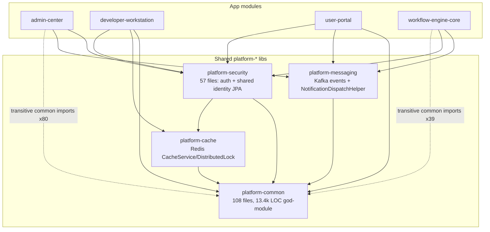

# X-ray: Shared / Cross-cutting Layers

Repo: `/Users/qiweige/Desktop/PROJECTXXXSUN/Workflow-Station---sun` (branch `common_0701_timeline`, 2026-07-18)

---

## 1. Backend shared modules

### 1.1 Module dependency table (pom.xml declared deps)

Evidence: `grep '<artifactId>platform-' <module>/pom.xml` in `backend/`.

| Module | Declares (pom) | Actually imports (`import com.platform.*` counts in src/main) |
|---|---|---|
| `admin-center` | platform-security, platform-messaging | security 170, **common 80 (TRANSITIVE — not declared)**, messaging 2 |
| `developer-workstation` | platform-common, platform-cache, platform-security | common 77, security 32, cache 1 |
| `user-portal` | platform-common, platform-messaging, platform-security | common 94, security 47, messaging 4 |
| `workflow-engine-core` | platform-messaging, platform-security | **common 39 (TRANSITIVE — not declared)**, messaging 4, security 2 |
| `platform-cache` | platform-common | — |
| `platform-messaging` | platform-common | — |
| `platform-security` | platform-common, platform-cache | — |

Platform-layer internal graph: `common` ← `cache` ← `security`; `common` ← `messaging`. `platform-common` is the root of everything.

**Smell:** admin-center (80 imports) and workflow-engine-core (39 imports) rely on platform-common purely transitively via platform-security/platform-messaging — an undeclared compile dependency that would break if the intermediates ever stopped re-exporting it.

### 1.2 platform-common (`backend/platform-common`, ~13.4k LOC main)

What it exports (package inventory, `com.platform.common.*`):

| Package | Contents | Notes |
|---|---|---|
| `dto` | `ApiResponse`, `ErrorResponse`, `PageRequest/PageResponse`, `UserPrincipal`, `DataFilter`, `PkGenerationConfig`, Relation* DTOs | Canonical REST envelope used by all 4 apps |
| `exception` | `PlatformException`, `BusinessException`, `ValidationException`, `ResourceNotFoundException`, `PermissionDeniedException`, `GlobalExceptionHandler` (340 LOC), plus `StateError`/`TransactionError`/`VersionValidationError` | Central error-handling governance |
| `enums` | `ErrorCode`, `Language`, `Module`, Relation* enums | |
| `config` | 20+ classes: `ConfigurationManager(+Impl 426 LOC)`, per-domain config records (`ApiConfig`, `DatabaseConfig`, `SecurityConfig` 335 LOC, `MessagingConfig` 386 LOC, `WorkflowConfig`, `MonitoringConfig`, `CacheConfig`), validation, runtime updater, `TraceIdFilter`, auto-configuration | A whole "configuration platform" subsystem lives here |
| `config.security` | `SecureCredentialManager` (307), `ConfigurationEncryptionService`, `ConfigurationAuditLogger` | |
| `security` | `SecurityIntegrationService` (632), `EnhancedAuthorizationManager` (594), `EnhancedAuthenticationManager` (530), `SecurityAuditLogger` (532), `SsrfProtection` | **Overlaps in concept with platform-security module** — security logic in the "common" module |
| `audit` | `@Audited` annotation + `AuditAspect`, `AuditService`, `SystemAuditFields` | AOP audit; `SystemAuditFields` has a frontend twin `frontend/shared/src/systemAuditFields.ts` |
| `jdbc` | `SqlIdentifiers`, `SubTableRowKeySupport` (362), `SubTablePhysicalColumnResolver`, `PostgresPhysicalTablePrimaryKeys` | Low-code physical-table runtime helpers |
| `fk` | `PrimaryKeyAllocationService` (+Jdbc impl) | PK allocation |
| `functionunit` | `DeploymentResult/Status/Strategy`, `ImportResult`, `RollbackResult`, `StatusMapping`, `Environment` | FU lifecycle value types shared DW↔portal |
| `relationtable` | CSV formatter/validator, `RelationTableTemplateService` | |
| `i18n` | `I18nService(+Impl)`, `PlatformLocaleResolver` | Backend i18n |
| `resource` | `ResourceManager` (357), `ConnectionPoolManager`, `AbstractBaseController` | Base controller class |
| `health`, `mail`, `util`, `version`, `constant` | health indicators, `SmtpTransportProperties`/`MailDiagnostics`, `JsonUtils`/`StringUtils`/`SafeUrlInput`/`ApiResponseBodyUnwrap`, `SemanticVersion`, `PlatformConstants` | |

**Coupling assessment:** platform-common is a **grab-bag / god-module**: REST envelope + exceptions (legit shared kernel) mixed with an entire configuration-management subsystem, a parallel security stack, mail, health, low-code JDBC runtime, and FU deployment types. Every app depends on it (directly or transitively), so any change here rebuilds/risks all 4 services.

**God-class candidates (by size, `wc -l`):**
- `security/SecurityIntegrationService.java` — 632 LOC
- `security/EnhancedAuthorizationManager.java` — 594 LOC
- `security/SecurityAuditLogger.java` — 532 LOC
- `security/EnhancedAuthenticationManager.java` — 530 LOC
- `config/impl/ConfigurationManagerImpl.java` — 426 LOC
- `config/MessagingConfig.java` — 386 LOC (a config class this size = smell)
- `jdbc/SubTableRowKeySupport.java` — 362 LOC (hot low-code path; has frontend counterpart in `frontend/shared`)

The top-4 are all in `common.security`, duplicating the *concern* of the dedicated `platform-security` module — the clearest architectural debt in the shared layer.

### 1.3 platform-cache (4 files)

- `config/RedisConfig.java`, `service/CacheService.java` (interface), `service/DistributedLock.java`, `service/impl/RedisCacheServiceImpl.java`.
- Consumers: **developer-workstation only** among apps (single import: `com.platform.cache.service.CacheService` — evidence `grep` in `backend/developer-workstation/src/main`), plus `platform-security` (declares it in pom, presumably token/permission caching).
- Assessment: thin, well-scoped Redis wrapper; near-minimal coupling. Not a risk.

### 1.4 platform-messaging (12 files)

Exports:
- `config/KafkaConfig.java`, `config/KafkaTopics.java` — topics: `platform.{process,task,permission,deployment,notification}.events` + `.dlt` dead-letter topics for all five + `.retry` for process/task.
- `event/` — `BaseEvent` + `ProcessEvent`, `TaskEvent`, `PermissionEvent`, `DeploymentEvent`, `NotificationEvent`.
- `service/EventPublisher` + `impl/KafkaEventPublisher` (producer side).
- `handler/DeadLetterHandler` (has `@KafkaListener`).
- `support/NotificationDispatchHelper` — the de-facto public API most apps touch.

Consumers (import evidence):
- **workflow-engine-core**: `NotificationDispatchHelper` in `TaskAssignmentListener`, `ProcessEngineComponent`, `TaskCompletionService`, `TaskActionService` (producer of task/notification events).
- **admin-center**: `NotificationDispatchHelper` in `DeploymentManagerComponent`, `PermissionRequestService` (producer).
- **user-portal**: the only app-level Kafka **consumer** — `com/portal/component/NotificationKafkaConsumer.java` (`@KafkaListener` on `KafkaTopics.NOTIFICATION_EVENTS`) feeding `NotificationServiceImpl`.
- developer-workstation: no messaging dependency at all.

Assessment: clean hub-and-spoke (engine/admin publish → portal consumes → STOMP WebSocket to browser). Small, cohesive; no god classes.

### 1.5 platform-security (inventory only; auth flow covered elsewhere)

Public surface (57 files, `com.platform.security.*`):
- **Controller**: `AuthController` (login/refresh REST endpoints live in the *library*, mounted into each app).
- **DTOs**: `LoginRequest/Response`, `RefreshRequest`, `TokenResponse`, `UserInfo`, `ResolvedUser`, `UserEffectiveRole`, `RoleSource`.
- **Entities (shared JPA model!)**: `User`, `Role`, `Permission`, `UserRole`, `RolePermission`, `BusinessUnit`, `BusinessUnitRole`, `UserBusinessUnit`, `UserBusinessUnitRole`, `VirtualGroup(+Member,+Role)`, `RoleAssignment`, `LoginAudit`.
- **Repositories**: `UserRepository`, `PermissionRepository`, `RoleAssignmentRepository`, `PermissionDelegationRepository`, `LoginAuditRepository`.
- **Services**: `AuthenticationService`, `JwtTokenService`, `PermissionService`, `UserRoleService`, `PermissionDelegationService` (+impls, `LoginAuditService`).
- **Filter/config**: `JwtAuthenticationFilter`, `JwtProperties`; **encryption**: `EncryptionService`/`AesEncryptionService`, `@Encrypted`.
- **Resolvers**: `TargetResolver(Factory)`, `UserTargetResolver`, `VirtualGroupTargetResolver`; `util/SecurityContextUtils`.

Coupling note: this is not a thin auth library — it ships the **entire identity/org JPA schema + repositories** into every app, meaning all 4 services share direct DB access to the same identity tables (schema coupling, not API coupling).

### 1.6 Backend module dependency graph (Mermaid)



---

## 2. Frontend shared infrastructure

### 2.1 Verdict: three standalone npm apps with two partial sharing mechanisms bolted on

- `frontend/pnpm-workspace.yaml` exists (`packages/*`, admin-center, user-portal, developer-workstation, login) **but every app still has its own `package-lock.json`** (npm, not pnpm) and **no app declares `@workflow-station/core`** in its package.json (grep across all 4 package.json: zero hits). The workspace is **scaffolding only, not wired**.
- Root `frontend/package.json` (`workflow-frontend-tools`) is not an app umbrella — it is a Playwright verification-script harness (`frontend/scripts/*.mjs`, ~25 verify/regression scripts).

### 2.2 The two sharing mechanisms

**A) `frontend/shared/` — Vite-alias source sharing (REAL, in use).**
Per its README: single source for logic that must stay identical across the 3 apps; consumed with **no npm package/build step** via alias `'@platform-shared': resolve(__dirname, '../shared/src')` in all three `vite.config.ts` (evidence: admin-center L27, user-portal L29, developer-workstation L59). Pure TS only. Current modules (3 files):
- `tableFkRuntime.ts` (portal+DW FK/PK runtime; backend twin `SubTableRowKeySupport`)
- `pkGenerationConfig.ts` (all 3 apps)
- `systemAuditFields.ts`
Apps keep re-export shims at historical paths (e.g. `user-portal/src/utils/tableFkRuntime.ts` → `export * from '@platform-shared/tableFkRuntime'`). Importers found in all 3 apps (8 files).

**B) `frontend/packages/core` — `@workflow-station/core` pnpm workspace package (SCAFFOLD, not consumed).**
Contains only `languageLabel.ts` + index. README explicitly says: workspace built but "本次脚手架未改动三 app 的 import", pending build verification. Meanwhile all three apps still carry identical 28-line `src/utils/languageLabel.ts` copies.

### 2.3 Copy-paste duplication (measured)

`wc -l` of same-path files across apps:

| File | admin | portal | DW | Status |
|---|---|---|---|---|
| `utils/languageLabel.ts` | 28 | 28 | 28 | identical triplets (the extraction target of packages/core) |
| `api/auth.ts` | 215 | 243 | 152 | **diverged copies** — `.kiro/issues` ISSUE-095 marked `wontfix` ("三端独立构建、无共享 npm 包"); token key prefixes `ws_ac_/ws_up_/ws_dw_` intentionally distinct |
| `utils/sso.ts` | 82 | 66 | 56 | diverged copies |
| `utils/httpErrorMessage.ts` | 74 | 106 | 94 | diverged copies |

Record-note: **not copied** — different components per role. Portal has the runtime renderer `user-portal/src/components/RecordNoteField.vue` + `api/recordNote.ts`; DW has designer-side `RecordNotePlaceholderWidget.vue` / `RecordNoteScopeSelect.vue` only. Reasonable split, no duplication here.

Known un-merged fork (README): `subTableRowRuntime` (portal split-directory vs DW single file, MI hot path).

---

## 3. Dead-code inventory (frontend)

| Directory | Contents | References found | Status label |
|---|---|---|---|
| `frontend/gateway-mfe` | `dist/` (built 2026-05-28) + `node_modules` only, **no src** | Only in aspirational docs (`PROJECT_ARCHITECTURE.md` Phase 3 "gateway-mfe 微前端化", `docs/architecture/architecture-diagram.md`). Zero hits in deploy/, k8s yamls, nginx confs, or any source. No qiankun/single-spa anywhere in repo. | **DEAD (orphaned build artifact of a future-phase concept)** |
| `frontend/workflow-mfe` | dist (2026-05-29) + node_modules | zero references anywhere | **DEAD** |
| `frontend/delegation-mfe` | dist (2026-05-28) + node_modules | zero references | **DEAD** (delegation now lives in user-portal: `user-portal/src/api/delegation.ts`) |
| `frontend/notification-mfe` | dist (2026-05-28) + node_modules | zero references | **DEAD** (notifications live in user-portal store/WS) |
| `frontend/login` | full Vite app (`platform-login`, Vue3 + vue-i18n only, no router/pinia/element) | Deployed: `deploy/k8s/platform-login-frontend.yaml`; its `nginx.conf` serves `/login/` and proxies `/api/` → `${KONG_PROXY_URL}` | **LIVE — unified SSO login page** for all 3 apps (apps redirect via each app's `utils/sso.ts` `redirectToUnifiedLogin`; portal reads `VITE_SSO_LOGIN_ORIGIN`) |

All four `*-mfe` dirs are safe-delete candidates (recover ~4 x node_modules of disk too).

---

## 4. i18n

| App | Mechanism | Locales | Size (lines per locale) |
|---|---|---|---|
| admin-center | vue-i18n ^11.2.8, `src/i18n/locales/` | en, zh-CN, zh-TW | ~950 |
| user-portal | vue-i18n ^11.2.8, `legacy:false`, **`locale: 'en'` hard-fixed** (`src/i18n/index.ts:10` "Fixed to English"), fallback en | en, zh-CN, zh-TW | ~1035 |
| developer-workstation | vue-i18n ^11.2.8 | en, zh-CN, zh-TW | ~2070 (largest surface) |
| login | vue-i18n ^11.4.0 | **en, zh-CN only** (no zh-TW — inconsistency with the 3 apps) | ~29 |

Hardcoded-string risk (grep CJK chars in .vue): admin 11/56, portal 22/51, DW 18/100 files contain raw Chinese — nontrivial residue; note some are comments. There is a dedicated tracked spec `.kiro/specs/frontend-i18n-hardcoded-chinese/`, so the gap is known.

---

## 5. API client pattern per app

All three apps: single axios instance in `src/api/request.ts` (DW: `src/api/index.ts`), cookie-based auth (`withCredentials: true`), `X-User-Id` / `X-Username` headers injected from localStorage, response interceptor returns `response.data`, 401 → refresh-token queue (`isRefreshing` + `failedQueue`, `_retry` flag) → on failure `clearAuth()` + `redirectToUnifiedLogin()`. Error text via `pickHttpErrorBodyMessage` + i18n. This interceptor block is itself copy-pasted-then-diverged across the apps.

| App | baseURL | timeout | Notes |
|---|---|---|---|
| admin-center | `/api/v1/admin` | 30s | `notifyError` + `ApiError`/`httpCodeToErrorCode` typing |
| user-portal | `/api/portal` | **600s** (comment: external AI workflows can take minutes — smells like masking missing async design) | `ElMessage` errors |
| developer-workstation | `/api/v1` | (index.ts:23) | ~15 domain API files incl. `ap.ts` (Activepieces), `aiGeneration.ts` |
| login | raw fetch/axios to `/api/` proxied by its nginx to Kong | | |

Env vars: almost none — routing is same-origin relative paths through Kong. Only `VITE_SUPERSET_AUTHOR_URL` (admin), `VITE_SSO_LOGIN_ORIGIN` (portal). No `.env*` files committed in any app.

WebSocket (user-portal only): `@stomp/stompjs` + SockJS.
- `useNotificationWebSocket.ts` → SockJS `/api/portal/ws/notifications`, subscribe `/user/queue/notifications`, reconnect 5s, heartbeats 10s, auth via httpOnly cookie.
- `useSubTableWebSocket.ts` (lazy dynamic import) → `/api/workflow/ws/sub-table-updates`, with polling fallback `useSubTablePollingSync.ts`.
Full chain: engine/admin → Kafka `platform.notification.events` → portal `NotificationKafkaConsumer` → STOMP → `stores/notification.ts`.

---

## 6. Pinia stores

| App | Stores | Responsibilities |
|---|---|---|
| admin-center (8) | `user`, `role`, `organization`, `virtualGroup`, `audit`, `biManagement`, `functionUnit`, `relationTable` | identity/org admin, audit log views, BI + FU + relation-table management |
| user-portal (6 + index) | `user`, `task`, `pendingTask`, `pendingApproval`, `notification` | session/user; task lists split three ways; notification badge + WS feed. `stores/index.ts` does `export *` of all stores (barrel) |
| developer-workstation (1) | `functionUnit` | virtually everything else in DW is component-local/composable state |

Shared-mutable-state risks:
- Portal's `task` vs `pendingTask` vs `pendingApproval` are three stores over overlapping task data — refresh/invalidation drift risk between lists and badge counts (notification store also holds counts).
- Cross-app "shared state" is actually **localStorage**: `USER_ID_KEY`/`USERNAME_KEY`/`USER_KEY` read by axios interceptors; per-app key prefixes (`ws_ac_`, `ws_up_`, `ws_dw_`) are the only guard against session collision on one origin — explicitly flagged in `packages/core/README.md` as "别合并 key".
- DW having a single store means heavy designer state lives outside Pinia (harder to inspect, but less shared-mutation surface).

---

## 7. Root-level oddities

| Item | Contents | Classification |
|---|---|---|
| `logs/` | 21 MB of runtime `*.log` + `*.pid` (admin-center.log, api-gateway-prod.log, …) | **Local junk** — gitignored (verified `git check-ignore`), not committed; safe to delete |
| `~/` | literally a directory named `~` containing `.docker/daemon.json` (Feb 10) | **Junk/accident** — some tool expanded `~` wrongly; gitignored; delete (carefully: `rm -rf ./~`, never `rm -rf ~`) |
| `sample-employees.csv` | 3-line name/email/department sample | test fixture for CSV import demos; harmless |
| `scripts/` (root) | `clear-*-data.sql` cleanup scripts, `email-smtp-test/` | dev tooling (data reset) |
| `assets/` | 5 PNG design mockups (DW view designer, portal views) | design docs/tooling |
| `.kiro/` | committed: `issues.md`, `issues/index.yaml` (structured issue tracker with status/severity, e.g. ISSUE-095 wontfix), `specs/*/` (17+ feature specs with design/tasks), `steering`, `settings` | **Active tooling** — Kiro (AWS agent IDE) spec-driven workflow; also functions as the project's issue DB |
| `.hermes/` | `plans/2026-05-05_vue-admin-refactor.md` | legacy AI-tool planning artifact |
| `.codex/` | `config.toml` | OpenAI Codex CLI config (committed) — tooling |
| root `node_modules/` | present at repo root alongside `pom.xml` | stray install (likely playwright for `frontend/scripts`); junk-ish |
| `Project X-ray.md`, `PROJECT_ARCHITECTURE.md`, `BUILD_GUIDE.md` | docs | note PROJECT_ARCHITECTURE.md describes the *aspirational* Phase 1–5 gateway/MFE roadmap that explains the dead `*-mfe` dirs |

---

## 8. Frontend sharing graph (Mermaid)

```mermaid
graph LR
    subgraph apps["3 standalone npm apps (own package-lock.json each)"]
        ACF[admin-center]
        UPF[user-portal]
        DWF[developer-workstation]
    end
    LOGIN[frontend/login<br/>unified SSO page LIVE]
    SHARED[frontend/shared/src<br/>vite alias '@platform-shared'<br/>3 pure-TS modules — REAL sharing]
    CORE[frontend/packages/core<br/>'@workflow-station/core'<br/>pnpm workspace SCAFFOLD — 0 consumers]
    DUP[copy-paste layer:<br/>auth.ts / sso.ts / httpErrorMessage.ts / languageLabel.ts<br/>diverged per app]
    DEAD[gateway-mfe / workflow-mfe /<br/>delegation-mfe / notification-mfe<br/>dist-only, 0 references — DEAD]
    ACF --> SHARED
    UPF --> SHARED
    DWF --> SHARED
    ACF -.copies.- DUP
    UPF -.copies.- DUP
    DWF -.copies.- DUP
    ACF -->|redirectToUnifiedLogin| LOGIN
    UPF -->|redirectToUnifiedLogin| LOGIN
    DWF -->|redirectToUnifiedLogin| LOGIN
    CORE -.not wired.- apps
    DEAD -.no edges.- apps
```
