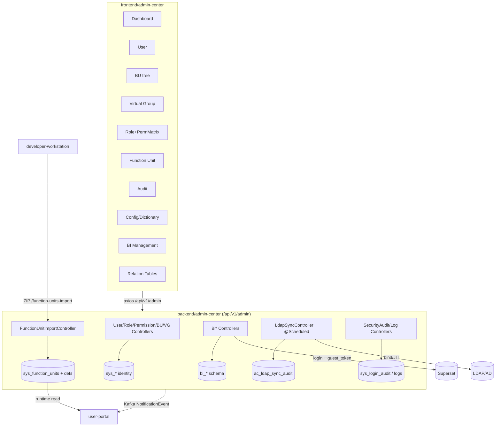

# Admin Center — Reverse-Engineering X-Ray

Scope: `backend/admin-center` (Spring Boot, **largest backend — 419 main files**, context-path `/api/v1/admin`) + `frontend/admin-center` (56 Vue / 90 ts). Platform-governance system: identity, RBAC, function-unit deployment target, BI, audit, LDAP.

Key frontend deps: `@superset-ui/embedded-sdk` (BI embed), `@vue-flow/*` (relation-table ER diagrams), `echarts`/`vue-echarts` (dashboard), `xlsx` (import/export), `dompurify`.

---

## 1. Route table (`frontend/admin-center/src/router/index.ts`)

Layout `layouts/AdminLayout.vue`, permission-based sidebar. Guard forces unified SSO login in PROD, gates on `requiredRoles`/permissions.

| Path | Component | Purpose |
|---|---|---|
| `/sso/callback` | `views/sso/SsoCallback.vue` | SSO exchange |
| `/dashboard` | `views/dashboard/index.vue` | Stat cards + echarts trends |
| `/user/list` | `views/user/UserList.vue` | User CRUD, detail, status, reset-pw |
| `/user/import` | `views/user/UserImport.vue` | Batch import (xlsx) |
| `/organization` | `views/organization/BusinessUnitTree.vue` | BU tree, members, roles, approvers |
| `/organization/department` | (BU tree variant) | department view |
| `/virtual-group` | `views/virtual-group/index.vue` | Virtual group list, members, roles, approvers |
| `/role`, `/role/list` | `views/role/RoleList.vue` | Role CRUD, members, **Permission Config matrix** |
| `/function-unit` | `views/function-unit/index.vue` | FU list, enable/disable, access config, deploy, version history/rollback, deployment records, import ZIP |
| `/audit` | `views/audit/index.vue` | Audit log (filter/detail/export) |
| `/config` | `views/config/index.vue` | System + business config, data dictionary |
| `/bi-management/dashboard-registry` | `views/bi-management/DashboardRegistry.vue` | Superset dashboard registry |
| `/bi-management/dashboard-assignment` | (assignment) | dashboard → user/role assignment |
| `/bi-management/rbac-mapping` | `views/bi-management/RbacMapping.vue` | platform role → Superset role mapping |
| `/relation-tables/structure[/create,/:id/edit,/er-diagram]` | `views/relation-table/structure/*` | Relation-table (rt_*) structure designer + ER diagram (vue-flow) |
| `/relation-tables/data` | `views/relation-table/data/index.vue` | Relation-table data grid |
| `/profile` | `views/profile/index.vue` | |
| `/403` | `views/error/403.vue` | |

API clients (`src/api/`): `auth`, `user`, `role`, `organization`, `businessUnit`, `virtualGroup`, `functionUnit`, `audit`, `config`, `dashboard`, `biManagement`, `relationTable`, `taskAssignment`, `monitor`, `ap`, `request`.

> **Observation:** LDAP sync and Gateway governance have **no dedicated frontend route** — LDAP sync is scheduled/backend-only (see §5); gateway-governance UI referenced in PROJECT_ARCHITECTURE.md does **not exist** (no `backend/api-gateway` module, no gateway-mfe wired). Permission-request approvals surface inside role/permission pages, not a standalone route.

---

## 2. Backend controller inventory (40 `@RestController`, base under `/api/v1/admin`)

**Identity / RBAC**
- `AuthController /auth`, `AuthSsoExchangeController /auth/sso`, `SsoAuthController /sso`, `SsoInternalController /internal/sso` (redeem, `X-Platform-Sso-Internal`) — see auth.md.
- `UserController /users`: create/`{id}`/status/reset-password/delete, `batch-import`, `export-template`, `/{id}/roles|virtual-groups|business-units|memberships`, `preferences`.
- `RoleController /roles`: CRUD, `/business`, `/developer`, `PUT/GET /{id}/permissions` (the resource×action matrix), members (paged/batch/count), `/{id}/history`.
- `PermissionController /permissions`: `/{id}`, `/resource/{res}`, `/check`, `/user/{id}`, delegations CRUD, **conflict detect/resolve/pending**.
- `BusinessUnitController /business-units` + `BusinessUnitRoleController /business-units/{unit}/roles` + `UserBusinessUnitRoleController /users/{id}/business-unit-roles`.
- `VirtualGroupController /virtual-groups` + `VirtualGroupRoleController /virtual-groups/{id}`.
- `MemberController`-equivalents: `ApproverController /approvers`, `MemberChangeLogController /member-change-logs`, `ExitController /exit`, `DeveloperPermissionController /developer-permissions`, `TaskAssignmentController /task-assignment` (BU-bounded/unbounded role lookups for DW assignee config).

**Function-unit deployment (the DW↔UP pivot)**
- `FunctionUnitController /function-units`: FU catalog governance, access config, enable/disable.
- `FunctionUnitImportController /function-units-import`: `POST /import` (multipart ZIP from DW), `POST /{id}/deploy`, `GET /{id}/process-deployment`, `POST /{id}/deploy-process`, `DELETE /{id}/undeploy-process`, `GET /deployed`, `POST /{id}/enable|disable`, `POST /{code}/activate/{version}`, `GET /{code}/versions`. **Writes `sys_function_units` + `sys_form/process/action_definitions`.**
- `ActionDefinitionController /actions`, `InternalEmailConnectionController /internal/function-units` (shared email conn `sys_email_*`).

**BI / Superset**
- `BiDashboardRegistryController /bi/dashboards`, `BiDashboardAssignmentController /bi/assignments`, `BiRbacMappingController /bi/rbac`, `BiGuestTokenController /bi/guest-token`, `BiSupersetAuthController /internal/bi/superset`.

**Audit / config / monitoring**
- `SecurityAuditController /security`: password/login/session policies, `POST /validate-password`, `POST /audit-logs/query`, resource-types, per-user/per-resource audit.
- `LogController /logs`: query/search/by-type/by-user + behavior, statistics, error-trend, performance-bottlenecks, export, retention-policies.
- `ConfigController /configs`, `DictionaryController /dictionaries`, `DashboardController /dashboard`, `SystemMonitorController /monitor`.
- `LdapSyncController /ldap-sync`: `POST /full|/incremental|/hermes-groups|/hermes-groups/incremental`, `GET /status|/audit-logs`.
- `PermissionRequestAdminController /permission-requests`, `ApprovalController /approvals`.
- `ApTokenController /internal/ap` (Activepieces gateway token bridge), `RelationTableStructureController /relation-tables/structures`, `RelationTableDataController /relation-tables/data`.
- `AdminApiExceptionHandler` — `@RestControllerAdvice`.

---

## 3. Key chains

### BI / Superset embed (Confirmed, scheduled-synced)
Admin UI (`@superset-ui/embedded-sdk`) → `BiGuestTokenController /bi/guest-token` → backend logs into Superset (`POST {superset}/api/v1/security/login`) then mints a **guest token** (`POST /api/v1/security/guest_token`) scoped to the embedded dashboard + RLS → SDK embeds. `bi_*` schema (`15-bi-management-schema.sql`) stores the dashboard registry, user/role assignments, and platform-role→Superset-role RBAC mapping. Two scheduled syncs (`@Scheduled bi.sync.cron` default every 6h): `DashboardSyncComponent` (pull Superset dashboard list) + `SupersetRoleSyncComponent` (push role mapping). Superset schema `40-superset-schema.sql`. SSO integration: see memory `superset-sso-integration` + auth.md.

### LDAP sync (Confirmed real, backend/scheduled — no UI page)
`LdapSyncService` + `LdapHermesGroupSyncComponent`, triggered by `@Scheduled(cron ldap.sync-cron, default every 2h)` **and** manual `POST /ldap-sync/full|incremental|hermes-groups`. Bind + JIT upsert of users/groups. Writes `ac_ldap_sync_audit` (`39/44-ac-ldap-sync-audit.sql`) via `LdapSyncAuditService`. `ShedLock` (`SchedulerLockConfig`) prevents multi-replica double-run. Gated by `ldap.enabled` (off in dev). Login-side LDAP is separate (auth.md).

### Function-unit deployment target
DW POSTs ZIP → `FunctionUnitImportController /import` → validate → `/deploy` writes `sys_function_units` + `sys_form/process/action_definitions` by code+version → `POST /{code}/activate/{version}` flips the enabled flag (partial unique index `idx_function_unit_code_enabled` = at most one enabled version per code, `11-add-unique-enabled-constraint.sql`). Engine BPMN deployed via `/deploy-process`. On undeploy/redeploy, admin-center calls user-portal `POST /internal/runtime/purge-by-catalog` (`PortalRuntimePurgeClient`, `X-Internal-Token`).

### Notifications (Kafka producer)
`DeploymentManagerComponent` + `PermissionRequestService` publish `NotificationEvent` to Kafka `platform.notification.events` (via `platform-messaging` `NotificationDispatchHelper`) → consumed by user-portal → STOMP. Admin-center is a **producer only** (no `@KafkaListener`).

### Audit (partial coverage)
`sys_login_audit` (+ `login_platform` col `51`), plus security audit-logs (`SecurityAuditController`) and general `LogController`. Login, permission requests, member changes (`member-change-logs`), LDAP sync, deployment are audited. **Coverage gap:** many CRUD mutations (BU/role edits, config changes) rely on general log capture rather than explicit domain-audit rows — verify per-controller before claiming full audit (see gaps).

---

## 4. Module diagram

---

## 5. Gaps / risks (status-labelled)

| # | Finding | Status | Evidence |
|---|---|---|---|
| 1 | Gateway-governance UI + `backend/api-gateway` module referenced in PROJECT_ARCHITECTURE.md **do not exist** | Missing (doc drift) | no `backend/api-gateway`, no gateway route in AC router |
| 2 | LDAP sync has **no admin UI** — only scheduled + raw POST endpoints; `GET /ldap-sync/status|audit-logs` exist but no confirmed page consuming them | Backend Only | `LdapSyncController`, no `ldap` view/api |
| 3 | Permission **conflict detect/resolve** endpoints exist — confirm a UI surfaces them (else orphan) | Unknown / possible Orphan | `PermissionController /conflicts/*` |
| 4 | Audit coverage uneven — some domain mutations captured only via general `LogController`, not explicit audit rows | Partially Implemented | §3 audit |
| 5 | 419 files but HTTP-layer tests near-zero (AuthController, SSO, SecurityAudit, TaskAssignment untested); AC frontend only 5 test files | Test gap | testing-quality.md |
| 6 | `LdapSyncService.java` 952 lines — God-class candidate | Technical Debt | testing-quality.md |
| 7 | BI guest-token: verify RLS scoping so a user cannot request a token for an unassigned dashboard | Needs review (security) | `BiGuestTokenController` + `bi/rbac` |
| 8 | `ApTokenController /internal/ap` shared-account bridge — token handling for Activepieces gateway | Confirmed (see ai-integrations.md) | file |

**Deployment pivot** (DW→AC→UP) is Confirmed working and is the single most load-bearing chain in the platform: admin-center is the sole writer of `sys_*` deployed artifacts that user-portal runtime depends on.
