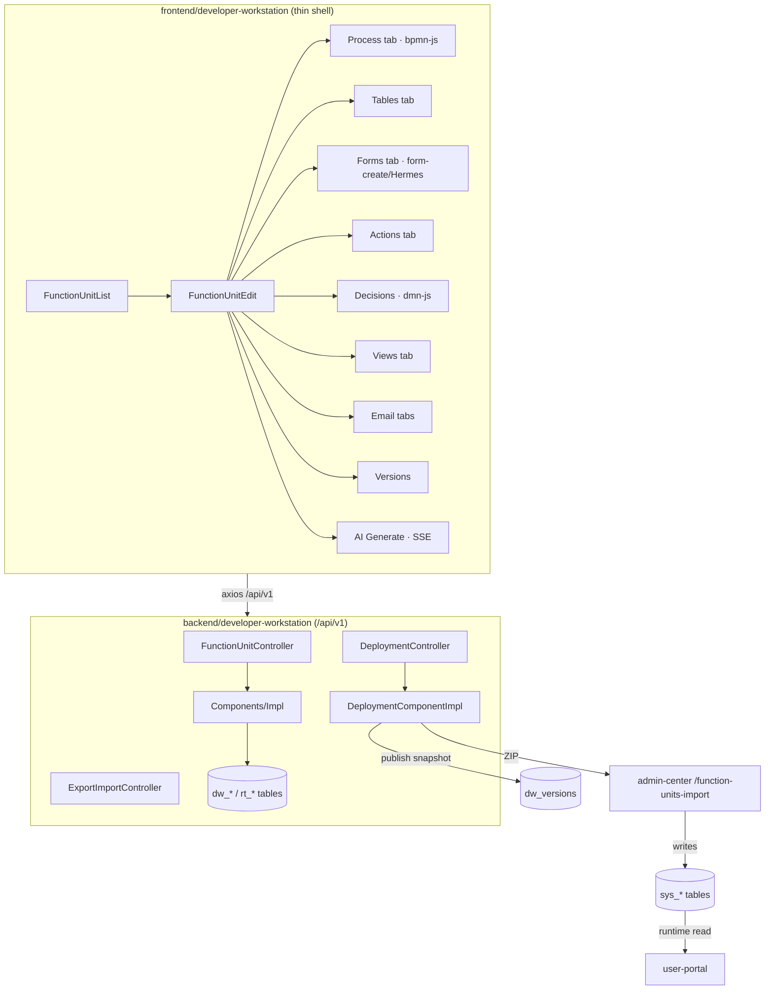

# Developer Workstation — Reverse-Engineering X-Ray

Scope: `backend/developer-workstation` (Spring Boot, package `com.developer`, 345 main files, context-path `/api/v1`) + `frontend/developer-workstation` (Vue 3 + Element Plus + Pinia, 100 Vue / 247 ts). Design-time system — SIT/UAT/PROD default **not deployed** (F5 in the architecture blueprint).

Key frontend deps: `bpmn-js` + `bpmn-js-properties-panel` + `@bpmn-io/properties-panel` + `bpmn-auto-layout` (process), `dmn-js` (decisions), `@form-create/designer` + `@form-create/element-ui` (form designer, branded "Hermes"), `@wangeditor/editor` (email rich body), `@vue-flow/*` (relation/ER graphs), `dompurify`.

---

## 1. Route table (`frontend/developer-workstation/src/router/index.ts`)

The DW frontend is a **thin shell** — nearly the entire designer lives inside ONE edit page's tabs.

| Path | Name | Component | Notes |
|---|---|---|---|
| `/sso/callback` | SsoCallback | `views/SsoCallback.vue` | SSO exchange, no auth |
| `/function-units` | FunctionUnits | `views/function-unit/FunctionUnitList.vue` | FU card/list, create/enter |
| `/function-units/:id` | FunctionUnitEdit | `views/function-unit/FunctionUnitEdit.vue` | **The whole designer** (tabbed) |
| `/profile` | Profile | `views/profile/index.vue` | |
| `/403` | Forbidden | `views/error/403.vue` | |

Layout `layouts/MainLayout.vue`, no sidebar (full-width). Guard forces unified SSO login in PROD; developer permission enforced backend-side via `@RequireDeveloperPermission` interceptor + `FunctionUnitWorkspaceAccessService` team scope.

### FunctionUnitEdit tabs (the real "pages")
`ProcessDesigner` · `TableDesigner` · `FormDesigner` · `ActionDesigner` · `DecisionList`/`DecisionDesigner` · `MainTableViewDesignTab` · `ConnectionDesigner` (email) · `EmailTemplateDesigner` · `EmailMonitorDesigner` · `VersionManager` · plus header actions: Settings (icon/name/desc), Export, Validate, **Deploy** (DeployDialog + polling), and AI Generate panel.

### API client files (`src/api/`)
`functionUnit.ts` (core axios, `/api/v1/function-units/*`), `decision.ts`, `connection.ts`, `emailTemplate.ts`, `emailMonitor.ts`, `mainTableView.ts`, `subTableView.ts`, `relationTable.ts`, `linkFormComponent.ts`, `adminCenter.ts`, `user.ts`, `icon.ts`, `aiGeneration.ts`, `ap.ts` (**types only, no HTTP**). `functionUnitAxios` interceptor treats `body.success===false` as an error even on HTTP 200; injects `X-User-Id` on every request.

---

## 2. Backend controller inventory (29 `@RestController`, base under `/api/v1`)

| Controller | Base path | Domain |
|---|---|---|
| `FunctionUnitController` | `/function-units` | FU CRUD, publish, restore, clone, validate, versions, compare, rollback, version export, dev-groups, workspace-access, tags |
| `DeploymentController` | `/function-units` | `GET /{id}/export`, `POST /{id}/deploy`, `GET /deployments/{depId}/status`, `GET /{id}/deployments` |
| `TableDesignController` | `/function-units/{fu}/tables` | table/field CRUD, `/{id}/ddl`, `/validate`, `/name-available`, `/foreign-keys`, `POST /primary-keys/allocate` |
| `TableRelationController` | `/function-units/{fu}/table-relations` | relation-table structure between tables |
| `FormDesignController` | `/function-units/{fu}/forms` | form CRUD, `/form-create-config`, `/validate`, bindings CRUD, `data-table-columns`, `/copy`, `/copy-to-task` |
| `FormStageBindingController` | `/form-stage-bindings` | form↔BPMN-stage binding (read-only flag `18-add-read-only-to-form-stage-bindings.sql`) |
| `ProcessDesignController` | `/function-units/{fu}/process` | `GET/POST process`, `/validate`, `/simulate`, `/debug/lookup/probe`, `/debug/actions/run` |
| `ActionDesignController` | `/function-units/{fu}/actions` | action-definition CRUD |
| `ActionQueryController` | `/actions` | cross-FU action lookup |
| `DecisionDesignController` | `/function-units/{fu}/decisions` | DMN CRUD, `/validate`, `/model` |
| `MainTableViewController` | `/function-units/{fu}/main-table-views` | view CRUD + `POST /seed-defaults` (+ access rules `51-dw-main-table-view-access.sql`) |
| `SubTableViewController` | `/api/forms/{formId}/sub-table-views` | sub-table view config (`33-dw-sub-table-view-tables.sql`) |
| `RelationTableViewController` | `/api/forms/{formId}/relation-views` | relation-table view config |
| `LookupComponentController` | `/api/forms/{formId}/lookup-config` | FK lookup config (`52-add-rt-lookup-config.sql`) |
| `LinkFormComponentController` | `/function-units/{fu}/link-form-components` | Link Form components (`34-dw-link-form-components.sql`) |
| `RelationTableBindingController` | (no base) | relation-table bindings |
| `EmailConnectionController` | `/function-units/{fu}/connections` | SMTP/IMAP conn CRUD + `/test` (`45-dw-email-connections.sql`) |
| `EmailTemplateController` | `/function-units/{fu}/email-templates` | template CRUD (`47`) |
| `EmailMonitorRuleController` | `/function-units/{fu}/email-monitors` | inbound monitor CRUD + `/by-start-event/{id}` (`48`) |
| `AiGenerationController` | `/ai-generation` | SSE chat/stream, session lock, documents, apply/undo (see ai-integrations.md) |
| `ExportImportController` | `/export-import` | `GET /function-units/{id}/export`, `POST /import`, `/validate`, `/check-conflicts` |
| `IconLibraryController` | `/icons` | FU icon library |
| `FileUploadController` | `/upload` | file upload |
| `MemberController` | `/members` | member directory (`20-add-members-table.sql`) |
| `AuthController` / `AuthSsoExchangeController` | `/auth`, `/auth/sso` | login + SSO exchange (see auth.md) |
| `HealthAliasController` | — | k8s probes |
| `AiExceptionHandler` / `WorkspaceExceptionHandler` | — | `@RestControllerAdvice` (Workspace one returns a **raw Map**, deviating from `ApiResponse`) |

### Designer domain model → deployment
`dw_function_units` (+ `current_version`, enabled) owns a tree of: `dw_table_definitions` (`table_type` MAIN/SUB) → `dw_field_definitions` (FK/PK metadata `43-dw-field-fk-pk-metadata.sql`, `pk_generation_json`) → `dw_form_definitions` (`config_json` = form-create rule tree) → `dw_form_table_bindings` (link modes `42`, subview columns `32`, `34-add-dw-binding-link-mode.sql`) → `dw_process_definitions` (BPMN, FU-unique `53`) + action definitions + decisions + `rt_*` relation tables. **Publish** snapshots the whole tree into `dw_versions` (`08-add-function-unit-versioning.sql`). **Deploy** (`DeploymentComponentImpl.executeDeployment`): publish → MI/last-task topology validation → `ExportImportComponent.exportFunctionUnit` ZIP → POST to admin-center `/function-units-import/import` → validate → deploy(autoEnable). DW **never writes `sys_*`** — admin-center does. Deployment jobs tracked in `dw_deployment_jobs` (`26`).

---

## 3. Interaction map (tab → button → dialog → API)

### Process tab — `ProcessDesigner.vue` (bpmn-js Modeler)
Zoom/Fit/Undo/Redo (canvas ops, no API); **Validate** → `GET .../process/validate` (client topology guard first); Export SVG/XML (client blob); **Debug** drawer → `ProcessDebugPanel`; **Save** → `POST .../process` (`{bpmnXml}`); auto-save debounced 2s. **Import dialog is wired but has NO toolbar trigger button → unreachable UI.** Property panels (`NodePropertiesPanel` dispatcher → UserTask/ServiceTask/SendTask/Gateway/Event/SequenceFlow/SubProcess/Process/Task) mutate BPMN extension elements only — persistence is via Save/auto-save. Exceptions that persist directly: `StartEventEmailMonitorSection` (email-monitor API) and DecisionList "Bind to Node" (saves process).
- **Assignee config** (`UserTaskAssigneeConfigSection`): INITIATOR/ENTITY_MANAGER/FUNCTION_MANAGER/HIERARCHY_ROLE/BU_ROLE/MANUAL_ASSIGN/ASSIGNEE_FROM_VARIABLE/ELEMENT_VARIABLE; loads BU tree + roles from admin-center `/task-assignment/roles/*`, `/business-units/tree`. Legacy `BU_UNBOUNDED_ROLE` shows deprecation warning. Stores role/BU **codes** (env-stable).
- **ServiceTask**: http/script/message/**ap**/dmn. AP task (`ApTaskPropertiesPanel`) stores only `flowId`+mapping in BPMN ext — **no AP flow-list fetched** (engine builds webhook URL at runtime; see ai-integrations.md).
- **Debug** is offline stepping over ONE simulate response: only Start (`POST .../process/simulate` + getActions), Run Action (`.../debug/actions/run`), Lookup Probe (`.../debug/lookup/probe`, self-disables on 404/501) hit the server; Step/Continue/breakpoints are pure client state.

### Tables tab — `TableDesigner.vue`
Table/field CRUD → `POST/PUT/DELETE .../tables[/{id}]`; DDL preview `GET .../tables/{id}/ddl`; name-check `/name-available`; FK config `/foreign-keys`; table↔form binding via `TableBindingManager`. **Note:** DDL is generated for design/preview but business rows are JSON-stored at runtime, not physical tables (`json-row-storage-no-physical-tables` rule) — the DDL path is design-time metadata.

### Forms tab — `FormDesigner.vue` (form-create/Hermes, largest file 2253 lines)
Drag-drop form layout; `GET/PUT .../forms/{id}`, `/form-create-config`, `/validate`; bindings CRUD `.../forms/{id}/bindings`; copy/copy-to-task. `HermesEventConfig`/`HermesFnConfig` = client-only JS/hook editors (CodeMirror), zero backend calls. Sub-table field config, FK/PK metadata, link-form components integrated here.

### Actions tab — `ActionDesigner.vue`
Create/Edit/Test/Delete actions → `POST/PUT/DELETE .../actions[/{id}]`, `POST .../actions/{id}/test`; Save Binding rewrites BPMN action bindings then `POST .../process`. Action types: API_CALL/FORM_POPUP/PROCESS_SUBMIT/CUSTOM_SCRIPT/APPROVE/REJECT/TRANSFER/DELEGATE/ROLLBACK/DRAFT/WITHDRAW/COMPOSITE. **`availableRoles` dropdown is hardcoded empty `ref([])`** (UI-degraded).

### Decisions — `DecisionList.vue` + `DecisionDesigner.vue` (dmn-js)
List/Create/Delete → `decisionApi`; DecisionDesigner load/validate/save → `GET/PUT .../decisions/{id}`, `/validate`. **Falls back to `DEFAULT_DMN_XML` on any load error.** `decisionApi.getModel/updateModel` (`.../model`) defined but **unused**.

### Views — `MainTableViewDesignTab` + Sub-Table/Relation view designers
Main table view CRUD + seed-defaults + BU/Role access config (`dw_main_table_view_access`, paired BU+Role, empty=admin-only). Sub-table views (`/api/forms/{formId}/sub-table-views`), relation views, lookup config.

### Email — `ConnectionDesigner` / `EmailTemplateDesigner` / `EmailMonitorDesigner`
SMTP/IMAP connections (password never pre-filled on edit, `connectionType` forced SMTP) + `/test`; templates (rich body via wangeditor + variable insert, DOMPurify preview); inbound monitors with `EmailExtractionWizard` (fully client-side rule builder mirroring the backend interpreter). `EmailTemplateDesigner` edit **falls back to list row on detail-fetch failure**.

### Versions — `VersionManager.vue`
History / compare / rollback → `GET .../{id}/versions`, `/versions/compare`, `POST .../versions/{versionId}/rollback`, `GET .../versions/{versionId}/export`. Rollback must restore full FU design (tables/fields/FK/relations/forms/bindings/view-design+access/BPMN/actions/decisions/email) — see the `function-unit-version-rollback` skill for the known-gotcha list.

### Header — Deploy / Export / Validate / AI Generate
Deploy dialog (target env, strategy, auto-enable) → `POST /function-units/{id}/deploy` + poll `GET /deployments/{depId}/status`. Export → `GET /export-import/function-units/{id}/export` (ZIP). Import → `POST /export-import/import` (+ `/validate`, `/check-conflicts`). AI Generate → SSE stream (see ai-integrations.md).

---

## 4. Module diagram

---

## 5. Gaps / risks (status-labelled)

| # | Finding | Status | Evidence |
|---|---|---|---|
| 1 | Process **Import dialog has no trigger button** — feature unreachable from UI | UI Only / Broken entry | `ProcessDesigner.vue` (`showImportDialog` never set true) |
| 2 | `ActionDesigner` allowedRoles dropdown hardcoded empty `ref([])` | Partially Implemented | `composables/actionDesigner/*` |
| 3 | `decisionApi.getModel/updateModel` endpoints defined, no caller | Orphan API | `api/decision.ts` |
| 4 | Multiple silent fallbacks: DecisionDesigner→DEFAULT_DMN_XML, EmailTemplate edit→list row, debug form bindings→list API | Confirmed (governance) | per-component |
| 5 | `WorkspaceExceptionHandler.onWorkspaceDenied` returns raw Map, breaking `ApiResponse` consistency | Confirmed | `WorkspaceExceptionHandler.java` |
| 6 | Stray `console.log` in `NodePropertiesPanel.vue:151` | Confirmed (minor) | file |
| 7 | `FormDesigner.vue` 2253 lines / `SubTableField` — God-component candidates | Technical Debt | testing-quality.md |
| 8 | Design-time DDL generation (`/tables/{id}/ddl`) coexists with JSON-row runtime storage — two mental models | Confirmed (arch) | TableDesignController vs json-row rule |
| 9 | HTTP layer (28 controllers) has near-zero controller-level tests; deployment/rollback tested only at component level | Test gap | testing-quality.md |

**Version flow** (dev→portal) is Confirmed working but historically fragile — see memory `version-sync-flow` (import once dropped manifest version, fixed) and the `function-unit-portability` skill (export/import/clone must carry ALL designer config).
