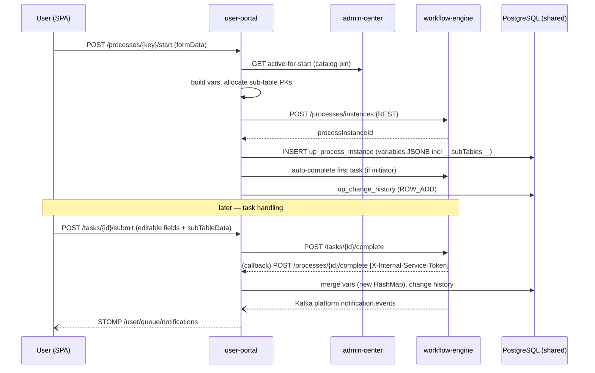

# User Portal — Reverse-Engineering X-Ray

Scope: `backend/user-portal` (Spring Boot, package `com.portal`, 198 main files) + `frontend/user-portal` (Vue 3 + Element Plus + Pinia, 51 Vue / 308 ts).
Evidence gathered 2026-07-18 from branch `common_0701_timeline`.

Key frontend deps (frontend/user-portal/package.json): `@stomp/stompjs` + `sockjs-client` (notifications), `@superset-ui/embedded-sdk` (BI), `@wangeditor/editor(-for-vue)` + `dompurify` (rich text), `bpmn-js` (progress diagram), `mathjs` (formulas), `echarts`/`vue-echarts` + `vue-grid-layout-v3` (dashboard).

---

## 1. Route Table (frontend/user-portal/src/router/index.ts)

All child routes are under `/` with layout `src/layouts/PortalLayout.vue` and `requiresAuth: true` (session verified via `verifyPortalSession()` → `GET /api/auth/me`, httpOnly cookie; router guard lines 185-239).

| Path | Name | Component (src/views/...) | Notes |
|---|---|---|---|
| `/sso/callback` | SsoCallback | sso/SsoCallback.vue | SSO ticket exchange, no auth |
| `/login` | UnifiedLogin | login/UnifiedLogin.vue | In PROD auto-redirects to unified SSO login (router line 191-197) |
| `/dashboard` | Dashboard | dashboard/index.vue | Grid-layout widget dashboard |
| `/tasks` | Tasks | tasks/index.vue | My pending tasks (incl. delegated) |
| `/tasks/completed` | CompletedTasks | tasks/completed.vue | Completed/historic tasks |
| `/tasks/:id` | TaskDetail | tasks/detail.vue | Task form runtime + actions |
| `/processes` | Processes | processes/index.vue | Function-unit catalog ("Start Request" discovery), pinning |
| `/processes/start/:key` | ProcessStart | processes/start.vue | Start-form runtime |
| `/my-applications` | MyApplications | applications/index.vue | My requests list |
| `/applications/:id` | ApplicationDetail | applications/detail.vue | Request detail: form data, BPMN progress, history, change history |
| `/delegations` | Delegations | delegations/index.vue | Delegation rules CRUD + audit |
| `/permissions` | Permissions | permissions/index.vue | Permission self-service (requests + approvals tabs) |
| `/my-requests`, `/approvals`, `/exit-role` | (redirects) | → `/permissions` | Legacy redirects (router lines 102-118) |
| `/member-management` | MemberManagement | permissions/member-management.vue | Member directory CRUD |
| `/notifications` | Notifications | notifications/index.vue | Notification center |
| `/profile` | Profile | profile/index.vue | Hidden from menu |
| `/bi-dashboard` | BiDashboard | landing/DashboardLanding.vue | Superset embedded dashboards |
| `/relation-tables` | RelationTables | relation-tables/index.vue | Admin-center deployed reference tables (read) |
| `/views/:functionUnitCode?` | MainTableViews | main-table-views/index.vue | Main Table Views runtime |
| `/403`, `/*` | Forbidden / NotFound | error/403.vue, error/404.vue | |

Access-mode gate: users with `portalAccessMode === 'PERMISSION_SELF_SERVICE_ONLY'` are forced onto `/permissions`, `/notifications`, `/profile` only (router lines 224-237).

## 2. Backend endpoint inventory (context-path `/api/portal`, port 8082)

All controllers return `com.platform.common.dto.ApiResponse<T>` unless noted. Token from `Authorization: Bearer` or httpOnly cookie (`up_access_token`, fallback `access_token`).

**Auth/session** — `AuthController /auth`: `POST /login`, `/logout`, `/refresh`, `/change-password`, `GET /me`, `/workspace-contexts`, `POST /switch-workspace`, `GET /validate`. Access mode claim `portalAccessMode` = `FULL` vs `PERMISSION_SELF_SERVICE_ONLY`. `AuthSsoExchangeController /auth/sso`: `POST /exchange` (redeem admin-center code; deferred workspace via in-memory `pendingRedeems` 300s TTL).

**Process catalog + start** — `ProcessController /processes`: `GET /definitions`, `/startable`, `/function-units/{id}/content`, `/function-units/{id}/contents`, `POST /function-units/{id}/tables/primary-keys/allocate`, `GET /fu-data/{id}` (@Deprecated), `/function-unit-contents/{id}` (@Deprecated), `GET /actions`, `POST /{key}/start`, `GET /my-applications`, `GET /{id}`, `POST /{id}/withdraw|urge|return-to-first`, `POST /{key}/favorite|draft`, draft GET/DELETE, `GET /{id}/history`, `POST /{id}/complete` (**internal callback, `X-Internal-Service-Token`, called by engine `ProcessCompletionListener`**). `ApiDataController /data-api/fu-contents/{id}` (alt path to dodge static handler; **no frontend caller**). `ProcessFormController`: `GET/PUT /processes/{id}/form`.

**Tasks/approvals** — `TaskController /tasks`: `POST /query`, `GET /{id}`, `/{id}/history`, `POST /{id}/claim|unclaim|complete|delegate|transfer|urge`, `POST /batch/urge`, `GET /statistics`, `POST /completed/query`, `GET /users/search` (**direct admin-center call**), `POST /{id}/sub-table-rows/{rowId}/assign`, `/sub-table-rows/assign-by-identity`, `GET /{id}/sub-table-data/all`. `TaskFormController /tasks`: `GET /{id}/form-data`, `POST /{id}/submit`, `GET /{id}/completed-form`. `ApprovalController /approvals`: proxy to admin-center (pending/approve/reject/is-approver/history).

**Views/relation tables** — `PortalMainTableViewController /main-table-views`: `GET /function-units`, `/{code}/views`, `/{viewId}/data`, `/{viewId}/export` (CSV), `POST /{viewId}/import`. `PortalRelationTableController /relation-tables`: list, `GET /{id}` (paged), `/export`, `/search`, `/lookup-configs/{formId}`, `/view-fields`, `/fields`, `POST /{id}/primary-keys/allocate`, row add/update/status, template, import.

**Record notes** — `RecordNoteController /record-notes`: `GET` list, `GET /{id}`, `POST` (multipart comment+attachments), `POST /inline-images`, `POST /adopt`, `PUT/DELETE /{id}`, `GET /{id}/content` (bytes), `GET /archive/{processInstanceId}` (ZIP).

**Other** — `ChangeHistoryController`: `GET /processes/{id}/change-history`. `NotificationController /notifications`: list, unread-count, mark read, read-all, delete. `DelegationController /delegations`: CRUD + suspend/resume + audit. `PermissionController /permissions` (live self-service, ~40 endpoints; VG-related ones **disabled/error**). `PermissionRequestController /permission-requests` (legacy; most POSTs **403-blocked**, superseded by `/permissions/*`). `UserPermissionController /my-permissions` (direct admin-center calls). `MemberController /members`, `ExitController /exit` (VG/BU POSTs **403-blocked**; only `GET /my-memberships` live). `DashboardController /dashboard`, `PreferenceController /preferences`. `InternalRuntimeController /internal/runtime` (`@Hidden`, `X-Internal-Token`): `POST /hydrate-process-instance` (← engine email inbound), `/purge-by-catalog` (← admin-center redeploy). `HealthAliasController`: `/health/live|ready`, `/.well-known/health`.

### Outbound clients
- `WorkflowEngineClient` (facade over Process/Task/TaskHistory clients) → engine `/api/v1/processes|tasks|history|monitoring|workflow` (REST, Resilience4j circuit breaker `portal-outbound-http`, read timeout **600s**). Forwards inbound `Authorization`.
- `AdminCenterClient` + `AdminCenterSsoClient` → admin-center permission-requests, members, exit, memberships, SSO redeem (`X-Platform-Sso-Internal`).

## 3. Form runtime (the heart of the portal)

**Definition source:** `configJson` (form-create rule tree) from `GET /processes/{id}/form` / `GET /tasks/{id}/form-data` / FU bundle `GET /processes/function-units/{id}/content` (`content.forms[]`).

**Parse pipeline:** `parseFormConfig` (`composables/taskDetail/useTaskDetailFieldExtraction.ts:36`) → `parseFormRulesLayout` (splits around `el-tabs`) → `extractFieldsRecursive` (walks row/col/card/tabs/collapse/subForm) → `FormField[]`. Parallel copies exist per context (applicationDetail, processStart) — duplication.

**Type mapping (2 layers):** form-create `type`→`FormField.type` via `typeMap` (`useTaskDetailFieldExtraction.ts:230`, e.g. `input→text`, `inputNumber→number`, `datePicker→date/datetime/daterange`, `userSelect→user`); then `FormField.type`→Element Plus element via the big `v-if` switch in `components/FieldRenderer.vue` (lines 7-623). Containers (row/col/card/tabs/subTable/recordNote/lookup) dispatched earlier in `FormRendererFields.vue`.

**Validation:** two layers unified in `composables/formRenderer/useFormValidation.ts` — (1) Element Plus `el-form` rules generated in `useFormData.ts:106`; (2) business-logic engine `validateAll`+`validateCrossField`, errors injected as DOM nodes (`.engine-error`). Field validators in `components/businessLogicEngine/validation.ts` (required/pattern/number/email/phone/custom + cross-field greater/less/equals/date-after).

**Math/computed:** mathjs only in `components/businessLogicEngine/formula.ts` — restricted instance, whitelist `SUM/AVG/MIN/MAX/ROUND/IF`, rejects dangerous keywords, **returns 0 on any error (silent)**. Recompute via `DependencyGraph` (leading-edge debounce 50ms), scoped to affected rules.

**Rich text:** @wangeditor in 3 places (main-form `editor` field, sub-table `editor` columns, RecordNote comments). Sanitization via dompurify allow-lists (`useFieldSanitize.ts`). **⚠️ `RecordNoteField.vue:148` renders `note.bodyHtml` via `v-html` WITHOUT client-side DOMPurify** — relies solely on server-side sanitization (only such path in the runtime). Sub-table lazy-loads dompurify with a **sync fallback that strips ALL tags** (`subTableHtmlSanitize.ts:18`).

**FK/PK runtime:** `LookupField.vue` loads the ENTIRE referenced table on focus (`GET /relation-tables/{id}/search`, page 200, hard cap 10000 with truncation warning); PK-hydration `fetchLookupRowByPrimaryKey` accepts **exact PK match only** (fixed the old `?? list[0]` wrong-row bug). PK auto-allocation deferred until Save → `POST /processes/function-units/{fu}/tables/primary-keys/allocate`. `utils/tableFkRuntime.ts` is a re-export shim to `@platform-shared/tableFkRuntime`.

**Sub-tables:** rows pre-loaded on `SubTableBinding.data` (no per-subtable GET); add/edit/delete are **local until task submit** (`POST /tasks/{id}/submit` with `subTableData`). Nested sub-tables (table inside a row dialog) supported via `nestedSubTableDescriptors`. MI (multi-instance) flatten/merge/hydration in `composables/tasks/subTable*.ts`. Alt-schema binding recursion guarded by `visitedBindingIds`. Row-level record notes (RECORD scope) bound to stable row id.

**Business-logic engine:** `components/businessLogicEngine/engine.ts` runs visibility (form-create `control`), formulas, linkages (option-filter/value-auto-fill/field-state), validation, sub-table per-row formulas + summary. Triggered on every field change (debounced) + mount/config-change/auto-save-restore.

**BPMN progress:** `ProcessDiagram.vue` (bpmn-js Viewer, drag-pan only) recolors nodes by status (rejected/current/completed) from `useBpmnParser`. `ProcessHistory.vue` is an `el-timeline` (not bpmn-js).

## 4. Runtime data-flow (start request → task → complete)

**JSON row storage (core architectural fact):** designer/business sub-table rows are stored as JSON inside `up_process_instance.variables.__subTables__`, **NOT** as physical per-table tables. All physical-table code (`SubTablePhysicalMetadataCache`, `SubTableEnrichmentComponent` physical SELECTs, `MiCollectionVariableBuilder` fuzzy `information_schema` search, `SubTableRowAssignmentComponent`) is **legacy/defensive and normally no-ops** (returns "absent"). The ONLY real physical tables are the demo `meeting`/`participants` FU (`fu-20260403-a1b2c5`, hard-coded in `MeetingParticipantVariablesPersistence.java:26`).

**Start flow** (`ProcessStartComponent.startProcess`, deliberately NOT `@Transactional` — HTTP calls run connection-free, DB writes in two short `TransactionTemplate` blocks):
1. Resolve active catalog pin ← admin-center `GET /function-units/code/{code}/active-for-start`.
2. Load BPMN via `getFunctionUnitContent`.
3. Deploy-once (cache keyed by `processKey + sha256(bpmnXml)`, per-key `synchronized` — a 200-concurrent burst deploys once).
4. Form data → engine variables: strip forged BU/role ids, inject initiator/functionUnit context, JWT-verified `activeBusinessUnitId`, allocate missing sub-table PKs.
5. **REST** start (not Kafka) → engine `POST /api/v1/processes/instances`.
6. Persist `up_process_instance` (status RUNNING, whole form map incl. `__subTables__` → `variables JSONB`, version pin columns) — **committed before auto-complete** so engine callbacks find the row.
7. Auto-complete first task if initiator task (compute sub-table condition vars like `totalPrice`/`itemCount`, submit).
8. Record initial change history (top-level fields + `__subTables__` rows as `ROW_ADD`).

**Task completion** (`TaskProcessComponent.completeTask`, `@Transactional`): dispatches by action. Form-save merges editable fields into a **new HashMap** of `variables` (in-place edits defeat Hibernate JSON dirty detection), strips deep-nested sub-tables, saves, records change history after commit. Approval path hydrates `__subTables__` from TaskInfo, `preserveEngineSubTablesOnComplete` guards against a bare approval overwriting engine service-task output with `[]`.

**PK allocation:** `JdbcPrimaryKeyAllocationService` on `dw_pk_sequences` / `rt_pk_sequences` (perTable scope, shared by all users), config from `dw_field_definitions.pk_generation_json`.

**Optimistic locking:** `@Version lock_version` on `ProcessInstance`, `up_delegation_rule`, `up_process_draft`, `RecordNote`. **No retry loop** — relies on single-write-txn discipline + last-write-wins. `up_change_history` is append-only (no `@Version`), written in `REQUIRES_NEW` txn so history failures never roll back the main flow.

**Notifications:** Kafka consumer `NotificationKafkaConsumer` (topic `platform.notification.events`) → `NotificationService.createFromEvent` (checks `in_app_enabled`, quiet-hours) → STOMP `convertAndSendToUser(userId, "/queue/notifications")`, endpoint `/ws/notifications`.

**Published-artifact model:** DW deploy → ZIP → admin-center `POST /function-units-import/import` → writes `sys_function_units` + `sys_form/process/action_definitions`. Portal reads **two schemas over shared PostgreSQL**: design content via `dw_*` native JdbcTemplate queries, FU resolution/access/enabled-state via **admin-center REST** (`FunctionUnitAccessComponent`). Enabled version pinned by partial unique index `idx_function_unit_code_enabled` (at most one enabled version per code).

---

## Database: portal tables (deploy/init-scripts/00-schema/)

Schema now lives in `deploy/init-scripts/00-schema/*.sql` (the per-module Flyway migrations were retired to `docs/legacy-flyway-migrations/user-portal/`). Portal tables (`03-user-portal-schema.sql`):

| Table | Purpose | Key columns |
|---|---|---|
| `up_process_instance` | One row per portal request; **JSON row storage** | `id` PK, `process_instance_id` (engine id), `business_key`, `status`, `variables JSONB` + `variables_json TEXT` (form data incl. sub-table rows), `current_node`, `current_assignee`, `candidate_users`, `lock_version BIGINT` (optimistic lock, added by `17-add-lock-version-to-user-portal-tables.sql`), catalog pin columns `function_unit_catalog_id` / `function_unit_code` / `function_unit_version_label` (`27-add-up-process-instance-catalog-pin.sql` — pins the FU catalog version at start time) |
| `up_process_history` | Activity/operation timeline per instance | `activity_id/name/type`, `operation_type`, `operator_*`, `comment`, `duration` |
| `up_change_history` | Per-field change audit (`19-add-up-change-history.sql`) | `process_instance_id`, `task_instance_id`, `stage_id`, `field_name`, `old_value/new_value`, `change_type`, `sub_table_name`, `row_identifier`, `is_concurrent` |
| `up_record_note` | RecordNote comments + attachments (`54-up-record-notes.sql`) | single Dataverse-annotation-style table; `note_type` COMMENT (body_html NOT NULL) or ATTACHMENT (`file_content BYTEA` in-DB); `target_type` TABLE (target_id = process instance id) or RECORD (target_id = sub-table row id); `table_kind` DW/RT; `parent_note_id` cascade; soft-delete `is_deleted`; `lock_version` |
| `up_permission_request` | Role/BU/virtual-group requests | `request_type`, `role_id/role_name`, `business_unit_*`, `virtual_group_*`, `submitted_by_user_id` (`29-...sql`), `status`, approver fields |
| `up_delegation_rule` / `up_delegation_audit` | Delegation config + audit | `delegator_id`, `delegate_id`, `delegation_type`, `process_types JSONB`, `lock_version` |
| `up_user_preference`, `up_dashboard_layout`, `up_notification_preference` | Per-user prefs, grid dashboard layout (JSONB config), notification prefs | |
| `up_favorite_process`, `up_process_draft` | Catalog favourites; saved start-form drafts (`lock_version`) | |
| `notification` (13-add-notification-table.sql) | In-app notifications | |
| `members` (`20-add-members-table.sql`) | Member directory (aligned with `com.developer.entity.Member`, shared) | |

Sub-table rows: physical per-FU tables (created by developer-workstation deployment, listed in `dw_table_definitions` with `table_type='SUB'`); `25-add-row-version-to-sub-tables.sql` loops all SUB tables and adds `row_version BIGINT DEFAULT 1` for optimistic locking of concurrent multi-instance subtask edits.

## 5. Runtime data-flow diagram

## 6. Gaps / risks (status-labelled)

| # | Finding | Status | Evidence |
|---|---|---|---|
| 1 | `sendUrgeNotification` is a **real stub** (only logs); urge/batch-urge write `up_delegation_audit` but deliver no notification | Partially Implemented | `TaskProcessComponent.java:494-498` |
| 2 | `RecordNoteField` renders server `bodyHtml` via `v-html` without client DOMPurify | Confirmed (risk) | `RecordNoteField.vue:148` |
| 3 | `isFunctionUnitEnabled` **fails OPEN** (returns true on admin-center error) — disabled FUs pass the gate during an AC outage | Confirmed | `FunctionUnitAccessComponent.java:135-144` |
| 4 | Large dormant physical-sub-table code path (metadata cache, enrichment SELECTs, MI fuzzy search) — architectural inconsistency vs JSON-row-storage rule | Dead Code (defensive) | `SubTablePhysicalMetadataCache.java`, `SubTableEnrichmentComponent.java:239-257` |
| 5 | Deprecated/blocked endpoints still routed: `ExitController` VG/BU POSTs (403), `PermissionRequestController` most POSTs (403), `PermissionController` VG stubs (error), `ApiDataController /data-api/fu-contents` (no caller) | Dead Code / Orphan | §2, source-grep of `frontend/user-portal/src` |
| 6 | `variables_json TEXT` legacy column alongside live `variables JSONB` | Dead Code | `03-user-portal-schema.sql` |
| 7 | `getTaskOrThrow` double-queries engine on miss (pointless retry, no backoff) | Confirmed (minor) | `TaskProcessComponent.java:353-363` |
| 8 | Stale comments claiming services "not yet implemented" that are fully live (`WorkflowEngineClient` javadoc, `NotificationServiceImpl:36`) | Confirmed (doc rot) | file javadocs |
| 9 | No optimistic-lock retry anywhere; concurrent field edits = last-write-wins + warning log | Confirmed (design choice) | `TaskFormComponent.taskFormWriteTx`, `detectConcurrentModifications` |
| 10 | Silent fallbacks: `evaluateFormula`→0 on error, RecordNote CRUD `catch {}`, user-search catch→`[]` | Confirmed (governance) | `formula.ts:64`, `RecordNoteField.vue:309`, `FormRenderer.vue:373` |
| 11 | Debug `console.log('[PERF-FR]')` + change-history `console.warn` left in production hot path | Confirmed (minor) | `FormRenderer.vue:92,625`, `api/processForm.ts:108` |

**Loop closure:** the core end-user journey (discover → start → fill form → submit → approve → complete → notify) is **Confirmed closed** end-to-end. The permission self-service journey is live but littered with 403-blocked legacy endpoints (VG concept removed from portal). Involved-users-only Main Table View access is Confirmed with SYS_ADMIN bypass.
